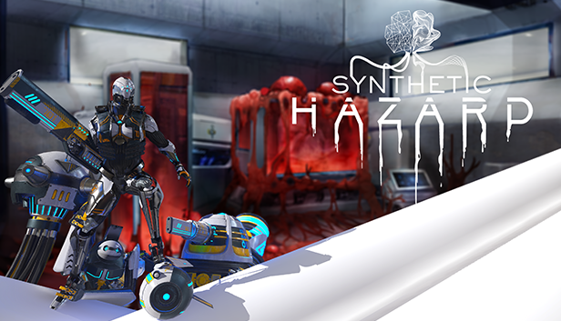

<!DOCTYPE HTML>
<!--
	Future Imperfect by HTML5 UP
	html5up.net | @ajlkn
	Free for personal and commercial use under the CCA 3.0 license (html5up.net/license)
-->
<html>
	<head>
		<title>Jbanosga Home</title>
		<meta charset="utf-8" />
		<meta name="viewport" content="width=device-width, initial-scale=1, user-scalable=no" />
		<link rel="stylesheet" href="assets/css/main.css" />
	</head>
	<body class="is-preload">

		<!-- Wrapper -->
			

				<!-- Header -->
					<header id="header">
						<h1><a href="index.html">Jorge Baños' Portfolio</a></h1>
					</header>

				<!-- Main -->
					

						<!-- Post -->
							<article class="post">
								<header>
									

										<h2><a href="single.html">Synthetic Hazard</a></h2>
										
FPS Roguelike developed in Unreal Engine 4

									

								</header>
								
								
Due to the negligence of scientists in a secret laboratory in the United States, a seemingly limitless parasitic technology manages to escape and take control of the facility. Your duty is to eradicate the parasite.

								<footer>
									<ul class="actions">
										<li><a href="single.html" class="button large">Continue Reading</a></li>
									</ul>
								</footer>
							</article>

				<!-- Sidebar -->
					<section id="sidebar">

						<!-- Intro -->
							<section id="intro">
								
								<header>
									<h2>Jorge Baños</h2>
									
Here I will keep you posted with updates of my ongoing projects!

								</header>
							</section>

						<!-- Mini Posts -->
							<section>
								

									<!-- Mini Post -->
										<article class="mini-post">
											<header>
												<h3><a href="single.html">Vitae sed condimentum</a></h3>
												<time class="published" datetime="2015-10-20">October 20, 2015</time>
												
											</header>
											
										</article>

									<!-- Mini Post -->
										<article class="mini-post">
											<header>
												<h3><a href="single.html">Rutrum neque accumsan</a></h3>
												<time class="published" datetime="2015-10-19">October 19, 2015</time>
												
											</header>
											
										</article>

								

							</section>

						<!-- About -->
							<section class="blurb">
								<h2>About</h2>
								
Mauris neque quam, fermentum ut nisl vitae, convallis maximus nisl. Sed mattis nunc id lorem euismod amet placerat. Vivamus porttitor magna enim, ac accumsan tortor cursus at phasellus sed ultricies.

							</section>

						<!-- Footer -->
							<section id="footer">
								<ul class="icons">
									<li><a href="#" class="icon brands fa-twitter">Twitter</a></li>
									<li><a href="#" class="icon brands fa-facebook-f">Facebook</a></li>
									<li><a href="#" class="icon brands fa-instagram">Instagram</a></li>
									<li><a href="#" class="icon solid fa-rss">RSS</a></li>
									<li><a href="#" class="icon solid fa-envelope">Email</a></li>
								</ul>
								
&copy; Untitled. Design: <a href="http://html5up.net">HTML5 UP</a>. Images: <a href="http://unsplash.com">Unsplash</a>.

							</section>

					</section>

			

		<!-- Scripts -->
			
			
			
			
			

	</body>
</html>
